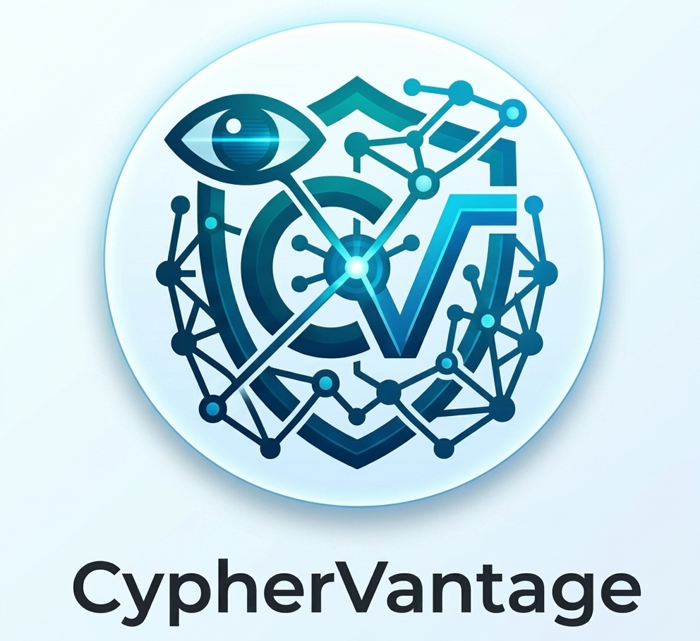
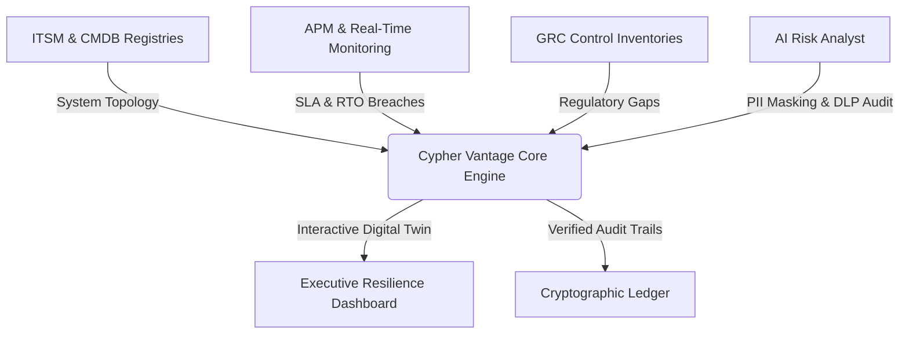

# ⚡ Cypher Vantage

  

  <strong>The Enterprise Operational Resilience, Threat-Led Penetration Testing (TLPT), and DORA Compliance Automation Suite.</strong>

  
  &nbsp;&nbsp;&nbsp;
  
  &nbsp;&nbsp;&nbsp;
  

  
  &nbsp;&nbsp;&nbsp;
  
  &nbsp;&nbsp;&nbsp;
  
  &nbsp;&nbsp;&nbsp;
  

---

## 🎯 What is Cypher Vantage?

**Cypher Vantage** is an enterprise-grade Operational Resilience Management and DORA compliance platform. It bridges the gap between executive risk oversight and core technical infrastructure, transforming raw system telemetry into real-time regulatory compliance mapping. 

The platform supports C-Suite decision makers and Risk Assurance teams with digital twin visualization, blast-radius threat simulation, and automated supplier control mapping.

🌐 **[Access the Live Showcase Portal](https://cyphervantageai.github.io/)**

---

## 🏛️ Platform Architecture

---

## ✨ Core Engineering Accomplishments

*   **⚡ Resilience Command Centre**: Real-time blast-radius visualizer computing upstream infrastructure outages (such as cloud region failures) directly to downstream business impact, financial risk, and DORA regulatory breaches.
*   **🌐 Executive Disruption Simulator**: Immersive stress-testing interface showing exact resilience metrics (RTO, MTTR, client impact) across 5 distinct C-Suite viewports (CRO, COO, CISO, Board, Regulator).
*   **📊 Digital twin & DORT Trees**: Interactive SVG-rendered relationship trees mapping Important Business Services (IBS) directly to systems, personnel, databases, and third-party subcontractors.
*   **🔒 Cryptographic Audit Proofs**: Tamper-evident evidence vault mapping file SHA-256 integrity hashes to DORA control requirements.
*   **🤖 AI Security Audit Suite**: Built-in prompt engineering audits, PII/credential sanitizers, and LLM Data Loss Prevention (DLP) gateways designed to assess compliance with the EU AI Act.

---

## 🛠️ Stack & Engineering Standards

*   **Architecture**: Vanilla ES6 Modules, custom client-side router, state persistence.
*   **Visual Design**: Glassmorphic dark/light UI, tailor-made responsive grid layouts, custom SVG canvas graph rendering.
*   **Testing & CI/CD**: Automated health check suite running local Selenium UI regression tests, syntax compilation verifications, and headless Chrome browser click-through drills.

---

# 🤖 The EAIOS Foundation

*Cypher Vantage is the flagship platform powered by the **Enterprise AI Operating System (EAIOS)**. While Cypher Vantage provides the user interface, digital twins, and DORA compliance mapping, EAIOS is the foundational, autonomous architecture that governs the AI Employees operating behind the scenes.*

## Enterprise AI Operating System (EAIOS)

EAIOS is an architecture-led enterprise operating model for humans and AI Employees operating under explicit governance and authority boundaries.

The architecture focuses on:
- Human accountability
- AI Employee governance
- Workforce organisation
- EAIES execution authority
- Orchestration
- Enterprise Memory
- AI Service Contracts
- Enterprise Work Items
- Security and adversarial validation

## Current architectural checkpoint

## EAIOS v0.8 — End-to-End Multi-Agent Traceability and Provenance

EAIOS v0.8 introduces end-to-end multi-agent workflow traceability, establishing immutable provenance across the entire delegation lifecycle without conflating coordination with execution authority.

The architecture enforces:
- **Correlation Identity**: A global, immutable provenance identifier tracks work from the root initiation through all subsequent child delegations.
- **Workflow-Level Accountability**: Complex multi-agent execution chains are fully visible and auditable under a single root identity.
- **Immutable Provenance Propagation**: The correlation identity is rigorously propagated from parent to child Work Items and into Enterprise Memory, preventing unrelated workflows from silently merging.
- **Traceability vs. Authority**: Correlation identity is explicitly non-authoritative provenance metadata. It is NOT an execution permission, NOT a capability, and NOT an authorization token.
- **EAIES Sovereignty**: The core invariant is upheld: "Coordination may propagate work; authority must never propagate implicitly." EAIES remains the sole execution-authorization boundary.
- **Governance**: Enterprise Memory operates as an immutable forensic ledger, securely anchoring the correlation identity across distributed orchestration pipelines.

---

### Previous checkpoint: EAIOS v0.7

EAIOS v0.7 introduces governed delegation admission controls, strengthening the resilience and security of multi-agent orchestration.

The architecture enforces:
- **Governed Admission**: Delegation requests now have explicit request identity/idempotency semantics, protecting against duplicate requests.
- **Distributed Consistency**: Delegation initiation controls operate consistently across distributed orchestrator instances.
- **Concurrent Fan-Out Protection**: Active-child admission is protected against concurrent fan-out races.
- **Structural Separation**: Structural admission controls remain separate from execution authorization.
- **Non-Transitive Authority**: Delegation does not implicitly transfer authority from one AI Employee to another.
- **Execution Boundary**: EAIES remains the sole execution-authorization boundary.

The architecture preserves human accountability and governed execution.

---

### Previous checkpoint: EAIOS v0.6

EAIOS v0.6 implements Governed Multi-Agent Delegation, enabling AI Employees to decompose work and coordinate through a secure Delegation Lineage.

Core to this update is **Non-Transitive Authority**: an AI Employee cannot transfer its own execution privileges to another AI Employee through delegation.

Key principles delivered in v0.6:
- **Independent Execution Evaluation**: EAIES Enforcement independently evaluates each AI Employee's authority to perform a delegated task.
- **Controlled Initiation**: Strict rate limits and active-child constraints prevent unconstrained workload generation.
- **Bounded Recursion**: Explicit depth limits prevent unbounded recursive delegation cycles.
- **Auditability**: Enterprise Memory retains immutable evidence of all delegation commands.

---

### Previous checkpoint: EAIOS v0.5

EAIOS now separates:

Capability Definition
from
Execution Authority

**Capability Registry:**
defines capabilities and their requirements.

**Orchestrator:**
coordinates enterprise work.

**EAIES:**
determines whether a capability may actually execute.

**AI Employees:**
perform the authorised execution.

- Work Item established in v0.4
- Capability Registry established in v0.5
- EAIES remains the authority boundary
- architecture is validated incrementally

## Validation status

- 123 passed
- 0 failed
- 10 skipped
- 20 Capability Registry security tests passed.

The skipped tests are infrastructure-dependent PostgreSQL concurrency tests and have not been counted as passed.

## Architectural principles

- Work does not create authority.
- Workforce membership does not create authority.
- Human approval does not create execution authority.
- Orchestration does not create authority.
- Enterprise Memory does not create authority.
- EAIES remains the execution-authority boundary.

---

## 📧 Enterprise Support & Security
For licensing, partnerships, or security inquiries, contact our assurance team at [support@cyphervantage.ai](mailto:support@cyphervantage.ai).

  © 2026 Cypher Vantage. All rights reserved.

