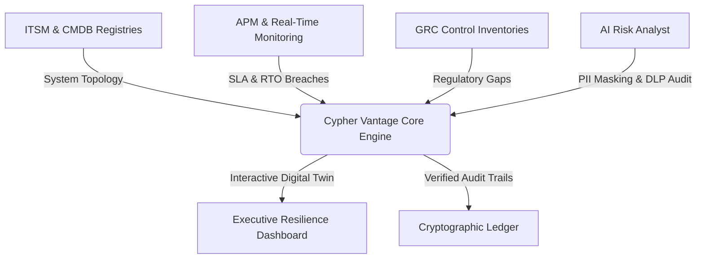

# ⚡ Cypher Vantage

  

  <strong>Interactive Operational Resilience, Threat-Led Penetration Testing (TLPT), and DORA Compliance Showcase Portal</strong>

  
  &nbsp;&nbsp;&nbsp;
  
  &nbsp;&nbsp;&nbsp;
  
  &nbsp;&nbsp;&nbsp;
  

---

## What Is Cypher Vantage?

**Cypher Vantage** is an interactive, browser-based demonstration platform for enterprise Operational Resilience Management, Third-Party Risk Management (TPRM), and regulatory compliance visualization.

It demonstrates how modern financial and critical infrastructure organizations can bridge the gap between high-level executive risk governance and low-level technical infrastructure telemetry. Powered by the **Enterprise AI Operating System (EAIOS)**, Cypher Vantage provides an intuitive digital twin interface for modeling system dependencies, simulating cloud outages, and verifying compliance controls.

🌐 **[Launch the Live Showcase Portal](https://cyphervantageai.github.io/)**

---

## The Portal

The live portal provides an interactive environment representing a simulated enterprise banking environment across several functional areas:

* **Executive Resilience Dashboard**: Multi-viewport dashboard tailored to executive leadership (Board, CRO, COO, CISO, and Regulator), tracking Important Business Services (IBS), critical SLAs, and live operational health.
* **Resilience Command Centre**: Real-time blast-radius visualizer computing how upstream cloud provider outages (e.g., AWS/Azure region disruptions) cascade into downstream business services and customer-facing operations.
* **IBS & CIS SLA Monitor**: Interactive dependency trees mapping Critical Information Services (CIS) and Important Business Services directly to underlying applications, databases, key personnel, and third-party vendors.
* **DORA Compliance Navigator**: Structured mapping of operational metrics and resilience controls against regulatory requirements, including ICT risk management, incident classification, and digital operational testing.
* **AI Audit Suite & LLM DLP Gateways**: Live demonstrations of prompt safety verification, PII/credential sanitization, and Data Loss Prevention (DLP) gateways designed to enforce responsible AI standards.
* **AI Evidence Collector & Cryptographic Vault**: Tamper-evident evidence vault mapping file SHA-256 cryptographic hashes directly to regulatory control obligations.
* **Supplier Control & Nth-Party Risk**: Dedicated portal for evaluating third-party vendor concentration risk, critical ICT subcontractor chains, and contractual resilience obligations.

---

## What the Portal Demonstrates

Through its interactive interfaces, Cypher Vantage visualizes core enterprise engineering and resilience concepts:

* **Digital Twin Topologies**: Dynamic representation of complex enterprise IT ecosystems and cross-service dependencies.
* **Disruption & Blast-Radius Modeling**: Deterministic calculation of Recovery Time Objectives (RTO) and Mean Time to Recovery (MTTR) under severe-but-plausible disruption scenarios.
* **Governed AI Decision Support**: Demonstrating how AI agents assist risk managers with automated log analysis, evidence gathering, and compliance gap identification without making unverified modifications.
* **Auditability & Traceability**: Cryptographic verification of compliance evidence, ensuring tamper-evident non-repudiation across multi-tier supplier relationships.

---

## EAIOS Architecture Behind the Portal

Cypher Vantage operates as the **demonstration and experience layer**, while the **Enterprise AI Operating System (EAIOS)** provides the autonomous backend systems architecture underneath it:

### The Architectural Relationship

* **Cypher Vantage (Showcase Portal)**: Visualizes operational resilience, presents executive viewports, and captures human operator decisions.
* **EAIOS (Backend Operating System)**: Manages AI Employee identities, verifies execution permissions, durably orchestrates multi-agent tasks, and records immutable evidence.

---

## Engineering Foundations

The backend governance powering Cypher Vantage is founded on the **EAIOS v1.0** architectural milestone:

* **Durable Workflow Execution (ADR-017)**: Workflows are structured as versioned DAGs. If an orchestrator node crashes, recovering workers reconstruct the runnable execution frontier directly from storage with zero volatile memory dependencies.
* **Distributed Work Item Resilience (ADR-016)**: Persistent execution leases, automated heartbeat crash detection, bounded retry budgets, and absolute UTC deadlines (`deadline_at`) guarantee resilience under real-world *at-least-once* network semantics.
* **Immutable Provenance (ADR-015)**: Globally propagated `correlation_id` binds multi-agent task chains and audit events to an immutable Enterprise Memory ledger.
* **Atomic Admission Control (ADR-014)**: Request-scoped idempotency keys and persistent rate-limiting prevent duplicate work and unbounded delegation fan-out.
* **EAIES Execution Sovereignty**: The core architectural invariant is strictly enforced:
  $$\text{"Coordination may propagate work; authority must never propagate implicitly."}$$
  Workflow state coordinates operational sequencing; the independent **Enterprise AI Execution Sovereignty (EAIES)** boundary evaluates every capability point-in-time.

For detailed technical specifications, state machines, and Pydantic models, refer to the canonical framework repository.

---

## Why This Matters

Enterprise adoption of artificial intelligence is undergoing a critical architectural shift:

$$\text{Isolated AI Chatbots} \quad \longrightarrow \quad \text{Governed AI Employees} \quad \longrightarrow \quad \text{Durable Multi-Agent Workflows}$$

1. **Phase 1 (Chatbots)**: Unstructured, stateless prompt wrappers operating without system boundaries or audit trails.
2. **Phase 2 (AI Employees)**: Stateful, identity-bound agents operating under formal AI Service Contracts and strict lifecycle controls.
3. **Phase 3 (Durable Workflows)**: Resilient, multi-step agentic execution capable of surviving process crashes, network partitions, and partial failures in highly regulated environments.

Cypher Vantage and EAIOS together demonstrate what is required to make Phase 3 an engineering reality.

---

## Explore the Live Portal

Experience the interactive showcase directly in your browser:  
🌐 **[Launch Cypher Vantage Showcase Portal](https://cyphervantageai.github.io/)**

---

## Technical Repository

For the underlying software framework, Architectural Decision Records (ADRs), and test suites:  
🏛️ **[CypherVantageAI/enterprise-ai-operating-system](https://github.com/CypherVantageAI/enterprise-ai-operating-system)**  
*The canonical technical framework repository for EAIOS.*

---

  🌐 <strong><a href="https://cyphervantageai.github.io/">Live Showcase</a></strong> &nbsp;•&nbsp; 🏛️ <strong><a href="https://github.com/CypherVantageAI">Organization Profile</a></strong> &nbsp;•&nbsp; 💻 <strong><a href="https://github.com/CypherVantageAI/enterprise-ai-operating-system">EAIOS Framework</a></strong>

  © 2026 CypherVantageAI. All rights reserved.

