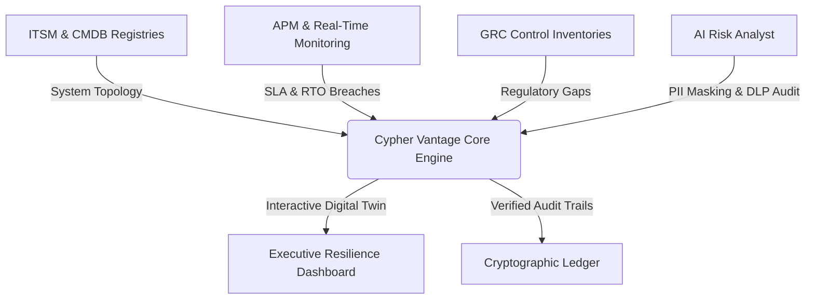

# ⚡ Cypher Vantage

  

  <strong>Interactive Operational Resilience, Threat-Led Penetration Testing (TLPT), and DORA Compliance Visualization Portal</strong>

  
  &nbsp;&nbsp;&nbsp;
  
  &nbsp;&nbsp;&nbsp;
  
  &nbsp;&nbsp;&nbsp;
  

---

## 🎯 What is Cypher Vantage?

**Cypher Vantage** is an interactive, enterprise-grade Operational Resilience Management and regulatory compliance showcase. It demonstrates how modern enterprise architecture bridges executive risk oversight with core technical infrastructure, translating complex system topologies and operational telemetry into actionable resilience insights.

The platform provides C-Suite decision makers, Risk Assurance leaders, and IT Operations teams with:
* **Interactive Digital Twins**: Dynamic visual topologies linking business services to technical infrastructure.
* **Blast-Radius Threat Simulation**: Real-time modeling of upstream cloud outages and cascading operational impact.
* **Automated Control Mapping**: Contextual mapping of operational metrics against regulatory resilience frameworks.

🌐 **[Launch the Live Showcase Portal](https://cyphervantageai.github.io/)**

---

## 🏛️ Platform Architecture

---

## ✨ Showcase Capabilities

* **⚡ Resilience Command Centre**: Real-time blast-radius visualizer calculating how upstream infrastructure outages (such as cloud region failures) impact downstream business operations, financial processes, and service thresholds.
* **🌐 Executive Disruption Simulator**: Stress-testing interface modeling resilience metrics (Recovery Time Objectives, Mean Time to Recovery, customer impact) across five distinct C-Suite viewports (CRO, COO, CISO, Board, Regulator).
* **📊 Digital Twin & DORT Trees**: Interactive SVG-rendered relationship trees mapping Important Business Services (IBS) directly to technical systems, personnel, databases, and third-party dependencies.
* **🔒 Tamper-Evident Audit Proofs**: Evidence vault mapping file SHA-256 integrity hashes to operational resilience control requirements.
* **🤖 AI Security & Governance Controls**: Demonstration of prompt safety audits, credential sanitization, and LLM Data Loss Prevention (DLP) gateways designed to support emerging AI safety standards.

---

## 🤖 The EAIOS Foundation

Cypher Vantage serves as the public reference showcase powered by the **Enterprise AI Operating System (EAIOS)**. While Cypher Vantage provides the visualization interface and digital twins, EAIOS provides the autonomous backend architecture that coordinates and governs AI Employees operating behind the scenes.

### EAIOS v1.0 Architectural Highlights

* **Coordination / Authority Separation**:
  $$\text{"Coordination may propagate work; authority must never propagate implicitly."}$$
  The architecture ensures that scheduling workflows never confers unverified execution authority.
* **Enterprise AI Execution Sovereignty (EAIES)**: An isolated policy enforcement boundary that independently verifies every capability request point-in-time against active security policy and AI Employee lifecycle status (`ACTIVE`, `SUSPENDED`, `RETIRED`).
* **Durable Workflow Execution (ADR-017)**: Multi-step workflows are modeled as versioned DAGs (`WorkflowDefinition`) with persistent node execution tracking (`WorkflowNodeExecution`). In the event of an orchestrator crash, a recovering worker reconstructs the runnable execution frontier directly from storage with zero volatile memory dependencies.
* **Distributed Resilience & Leases (ADR-016)**: Persistent execution leases, automated heartbeat sweeps, bounded retry budgets, and absolute UTC deadlines (`deadline_at`) under robust at-least-once network semantics.
* **Immutable Provenance (ADR-015)**: Globally propagated `correlation_id` anchoring multi-agent delegation trees and audit events to an immutable Enterprise Memory ledger.
* **Atomic Admission Control (ADR-014)**: Request-scoped idempotency keys and persistent rate-limiting preventing duplicate executions or runaway recursive delegation.

For full architectural specifications, Architectural Decision Records (ADRs), and formal invariants, visit the **[CypherVantageAI Organization Profile](https://github.com/CypherVantageAI)**.

---

## 🛠️ Stack & Engineering Standards

* **Architecture**: Vanilla ES6 JavaScript modules, custom client-side router, deterministic state persistence.
* **Visual Design**: Glassmorphic dark/light UI, responsive grid layouts, custom SVG canvas graph rendering.
* **Testing & CI/CD**: Automated test suite executing UI regression checks, syntax compilation validations, and headless browser workflows.
* **Operational Alignment**: Conceptually designed to reflect the resilience principles of **EU DORA (Articles 11 & 12)** and **UK PRA SS1/21** regarding operational continuity, incident detection, and impact tolerances.

---

## 📧 Enterprise Support & Assurance

For architecture inquiries, licensing, or partnerships, contact our assurance team at **[support@cyphervantage.ai](mailto:support@cyphervantage.ai)**.

  🌐 <strong><a href="https://cyphervantageai.github.io/">Access Live Portal</a></strong> &nbsp;•&nbsp; 🏛️ <strong><a href="https://github.com/CypherVantageAI">Organization Profile</a></strong>

  © 2026 CypherVantageAI. All rights reserved.

