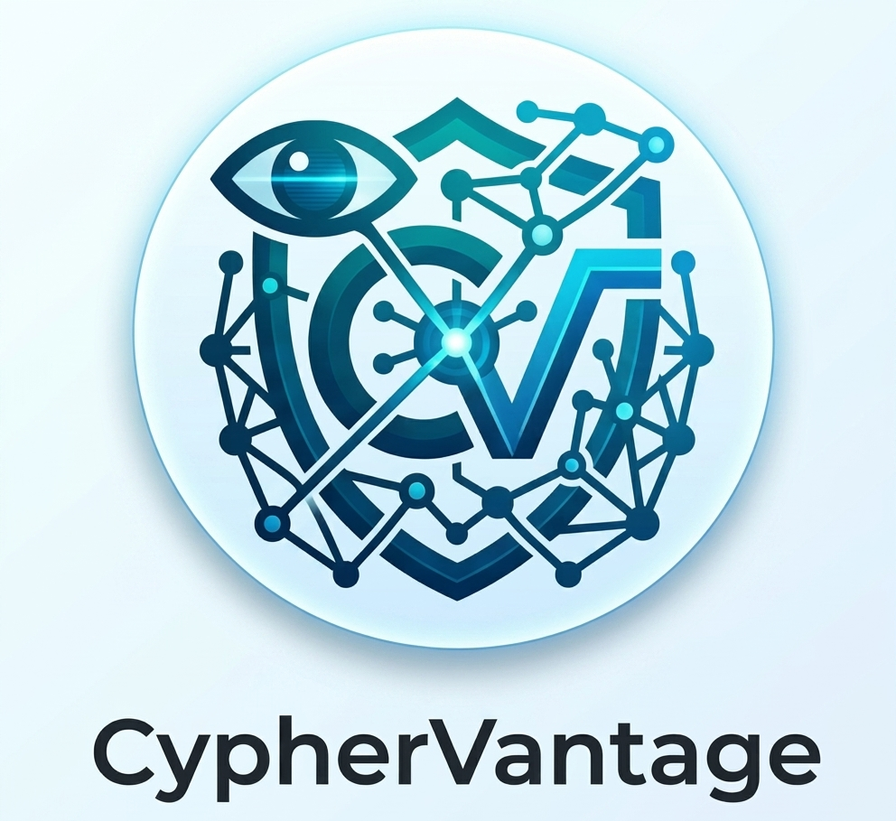

# Cypher Vantage - Operational Resilience & DORA Compliance Platform

<p align="center">
  
</p>

<p align="center">
  <strong>Autonomous Operational Resilience Management, Threat-Led Penetration Testing (TIBER-EU / TLPT), and Third-Party Risk Management (TPRM).</strong><br>
  <em>Version: 6.0.0</em>
</p>

---

## 🎯 Overview

**Cypher Vantage** is an enterprise-grade Operational Resilience Management platform designed to map critical business services to technical infrastructure, track active threat hotspots, automate compliance with regulations like EU DORA and UK PRA, and run Threat-Led Penetration Testing (TLPT) simulations in accordance with the TIBER-EU framework.

This repository hosts the **Cypher Vantage Core Platform Interface**, serving a dual purpose:
1. **Operational Resilience & Risk Manager Dashboard**: A rich client-side dashboard showcasing Risk Manager assurance views, DORA compliance tracking, TIBER-EU simulations, and Supplier evidence portals.
2. **EAIOS Architecture & ORO Showcase Console**: An interactive executive console for the Enterprise AI Operating System (EAIOS), demonstrating the Operational Resilience Officer (ORO) vertical slice (`src/eaios/`) with live backend orchestration.

🌐 **[Live Demo](https://cyphervantageai.github.io/)**

---

## ✨ Core Features

### 🌐 1. Op Resilience & DORA Dashboard
- **Nested Geographic Hotspot Drill-Down**: Clickable breadcrumb path (`Global > Region > Country > State > City`) mapping data centers, availability zones, and key personnel locations.
- **IBS & CIS Dependency Mapping**: Groups technical systems by external-facing **Important Business Services (IBS)** and internal-facing **Critical Internal Services (CIS)**.
- **Contextual Help Guides**: `[ ? ]` contextual micro-guides integrated on every module pane (powered by `contextualhelp.js`).
- **Compliance Alignment**: Directly traces platform controls to the **5 Core Pillars** of the EU Digital Operational Resilience Act (DORA).
- **Incident & Hotspot Simulator**: Real-time alerts for geopolitical stress and natural disasters with live failover verification logs.

### ⚡ 2. Executive Disruption Simulator
- **Interactive Disruption Scenarios**: Models 6 enterprise outage scenarios natively:
  1. `Cloud Outage (AWS us-east-1 Region Loss)`
  2. `Ransomware Data Integrity Hijack`
  3. `Third Party Supplier & Subprocessor Failure`
  4. `Identity Compromise & Privileged Access Hijack`
  5. `Payment Platform & Settlement Engine Failure`
  6. `Data Corruption & Journal Synchronization Desync`
- **Dynamic 6-Metric Engine**: Calculates Services Impacted, Customers Affected, Revenue Loss (£/hr & total loss), Statutory Regulatory Exposure (DORA Articles 11, 18, 50 & GDPR), Recovery Time (MTTR vs RTO target), and Recovery Confidence Score (%).
- **5 C-Suite Persona Readouts**: Generates board-ready outputs for:
  - 👔 `1. Executive / Board View`
  - ⚖️ `2. CRO View`
  - ⚙️ `3. COO View`
  - 🛡️ `4. CISO View`
  - 📜 `5. Regulator View`

### ⚔️ 3. TIBER-EU / Threat-Led Penetration Testing (TLPT)
- **Phase Tracker**: Visualizes red-team progress through TIBER-EU phases (Prep & Scope ➡️ Threat Intel ➡️ Red Team Exec ➡️ Closure & Replay).
- **Attack Permutation Simulator**: Launches red-teaming scenarios (Ransomware on Identity Gateways, Supply Chain Hijack, DDoS volumetric flooding, rogue administrator privilege escalation) with interactive terminal logs.
- **Resiliency Defenses**: Visually demonstrates automated container isolation and backup directory failovers in response to active attacks.

### 🤖 4. AI Auto-Collector & Evidence Parsing (TPRM)
- Automated scanning of uploaded supplier compliance documents (SOC 2, ISO 27001).
- Extracts and parses control obligations and flags compliance gaps (e.g., outdated failover drill logs).
- Allows Risk Managers to dispatch dynamic questionnaires targeting specific control modules.

### 📊 5. Intelligent Risk Scoring Models
- Dynamic risk weight calculators enabling managers to customize metrics for **ICT Security**, **Operational Resilience**, and **Governance**.
- Automatically computes tailored adjusted risk tiers (Low, Medium, High) based on real-time vendor compliance stats.

### 🗺️ 6. Continuous Attack Surface Mapping
- Real-time 360-degree digital footprint scans of external domains, VPN endpoints, and API gateways.
- **Subnet Node Discovery**: Simulates secure scans of internal VPN subnetworks to map private corporate interfaces.
- Custom target configurations to manually add new assets to active port scanning inventories.

### 🔒 7. Cryptographic File Integrity Ledger
- Registers SHA-256 signatures of evidence documents in the secure Cypher Vantage ledger.
- **Tampering Simulation**: Allows users to simulate document tampering and runs verification checks, raising alarms on hash mismatches.

### 🛡️ 8. AI Audit Suite
- **LLM DLP Gateway**: Outbound prompt proxy sanitization with real-time redaction of passwords, emails, credentials, and API keys.
- **Adversarial Agent Pentester**: Terminal simulation running DAN jailbreaks and system-prompt extraction exploits to audit third-party bot robustness.
- **EU AI Act Classifier**: Classifies vendor models into legal risk tiers (Minimal, Transparency, High, Prohibited) and lists mandatory requirements.

### 💾 9. Client-Side Database Persistence
- Implements browser `localStorage` state persistence. All uploaded files, custom audit states, dispatched tasks, scan records, resilience configurations, and security toggles persist across page refreshes.
- Quick **Reset Local Database** option in the sidebar footer to restore default demo configurations.

---

## 🏛️ EAIOS Architecture & ORO Showcase Console

This console showcases the **Operational Resilience Officer (ORO)** vertical slice of the **Enterprise AI Operating System (EAIOS)**, integrating interactive executive governance visualization (`src/eaios/`) with the live EAIOS distributed orchestrator.

### 🏢 Three-Repository Architecture & Boundaries
To preserve strict separation of concerns, governance boundaries, and code isolation, CypherVantage is structured across three repositories:
1. **`enterprise-ai-operating-system` (Private)**: The authoritative operating-system substrate containing private kernel architecture, sovereign EAIES policy evaluation, durable distributed orchestration state, and internal ADRs.
2. **`core-platform` (Private Source of Truth)**: The primary application and integration repository containing the full frontend code, simulation engines, DORA/TPRM dashboards, and the ORO executive showcase console.
3. **`CypherVantageAI.github.io` (Public Distribution Target)**: The static GitHub Pages hosting target. It is a compiled mirror that receives approved static artifacts; it is **not** a separate development source.

### 🚀 Automated Deployment Pipeline
Public showcase publication is fully automated from `core-platform`:
* Pushes to `core-platform:main` trigger the GitHub Actions workflow (`.github/workflows/deploy.yml`).
* The workflow synchronizes static web assets directly to `CypherVantageAI/CypherVantageAI.github.io:main`.
* Each deployment commit automatically records the exact triggering `core-platform` commit SHA for end-to-end traceability.

---

## ⚡ Executive Demo Run Sheet: Synthetic ORO Incident Flow

The showcase models an executive response to a major multi-tenant cloud infrastructure failure:

1. **Synthetic Incident Ingestion (`INC-2026-CLOUD-9941`)**:
   - The showcase initializes a critical incident involving primary AZ failure on ApexCloud EMEA, impacting critical payment message routers.
2. **DAG Frontier Evaluation & Autonomous Worker Dispatch**:
   - Nodes 1–3 orchestrate telemetry parsing, impact assessment, and policy lookups across independent synthetic agent personas.
3. **Structured Resilience Recommendation (Node 4)**:
   - Queries the live remote EAIOS backend (`POST /api/v1/showcase/oro/recommendation`) with an attempt-scoped `correlation_id`.
   - The backend runs a 5-node governed pipeline, pre-reserves budget tokens in memory, synthesizes a structured advisory recommendation, and settles tokens.
   - Node 4 transitions to `COMPLETED` and releases worker leases.
4. **Human-in-the-Loop Governance Barrier (Node 5)**:
   - Because resilience actions involve high blast-radius operations, execution durably pauses at Node 5 (`PAUSED_PENDING_INPUT`).
   - The UI presents a Four-Eyes executive decision banner requiring explicit human review.
5. **Human Approval / Rejection (Node 6)**:
   - On approval, Node 6 models action dispatch (`ACT-DR-001`) with fresh authorization evaluation.
   - On rejection, downstream actions are pruned and unused tokens refunded.

---

## 🔍 Independent Runtime Verification (Browser Network Panel)

Presenters and auditors can verify live backend integration directly in Chrome or Edge Developer Tools (`F12` > **Network** tab):

1. **Liveness Preflight Probe**:
   - **Method / URL**: `GET https://cyphervantageai.duckdns.org/health/live`
   - **Expected Status**: `HTTP 200 OK`
   - **Payload**: `{"status": "ok", "service": "enterprise-ai-operating-system"}`
2. **Advisory Recommendation Request**:
   - **Method / URL**: `POST https://cyphervantageai.duckdns.org/api/v1/showcase/oro/recommendation`
   - **Headers**: Verify outbound `X-Correlation-ID: <UUIDv4>` header.
   - **Request Body**: JSON containing `incident_id: "INC-2026-CLOUD-9941"` and synthetic vendor telemetry.
   - **Expected Status**: `HTTP 200 OK` (typically 400–600 ms).
   - **Response Payload Verification**:
     - `correlation_id`: Matches request UUID.
     - `governance_metadata.is_advisory_only`: `true`.
     - `governance_metadata.execution_authorized`: `false`.
     - `governance_metadata.human_approval_required`: `true`.
     - `governance_metadata.cost_governance.tokens_settled`: `150` (of 500 reserved).

### Offline & Error Behavior
- If the remote backend is unreachable or returns a non-200 error, Node 4 displays `Backend Offline` and marks the workflow `FAILED`.
- The frontend **does not** substitute a synthetic, canned, or mock recommendation upon network failure. Live backend failure halts advisory progression truthfully.

---

## 🔒 Public Security & Delivery Boundary

- **Client-Side Delivery**: All HTML, JavaScript (`src/eaios/`), and CSS served to the browser are inherently public and inspectable.
- **Zero Secrets**: The client contains zero private keys, API secrets, administrative tokens, database connection strings, or internal infrastructure hostnames.
- **Hermetic Backend**: Private EAIOS kernel code, database schemas, internal ADRs, and execution agents reside strictly in private backend infrastructure.

---

## 📋 Mandatory Showcase Governance Disclosures

The following governance disclosures strictly delimit the scope of the EAIOS ORO showcase:

1. **Advisory Scope**: The ORO recommendation is strictly advisory. A model confidence score is an analytical proposal, not execution authority.
2. **Synthetic Data**: The incident (`INC-2026-CLOUD-9941`), vendor telemetry, and IBS mappings are synthetic showcase data, not a live CMDB or production incident feed.
3. **Token Accounting Scope**: Displayed reservation and settlement values use request-scoped in-memory `MemoryUnitOfWork`; they do not demonstrate durable, system-wide PostgreSQL budget enforcement.
4. **Simulated Approval Gate**: The human approval gate is a simulated client-side UI state, not production-grade identity verification or hardware-backed WebAuthn.
5. **Zero Mutation Authority**: The showcase does not execute production DNS failover, cloud infrastructure recovery, or any external mutation.
6. **Liveness Semantics**: The `/health/live` endpoint demonstrates point-in-time liveness and network reachability, not complete downstream service readiness.
7. **Compliance Boundary**: The showcase does not establish full DORA regulatory compliance or prove that every EAIOS execution path has been independently audited.

---

## 🚀 Getting Started

The platform is built with vanilla ES modules, semantic HTML, and CSS. It requires no bundlers, compilation steps, or heavy build pipelines.

### Running Locally

1. **Clone the repository:**
   ```bash
   git clone https://github.com/CypherVantageAI/core-platform.git
   cd core-platform
   ```

2. **Start a local static development server:**
   - **Python 3:**
     ```bash
     python -m http.server 8080
     ```
   - **Node.js (http-server):**
     ```bash
     npx http-server -p 8080
     ```

3. **Open the browser:**
   Navigate to **[http://localhost:8080](http://localhost:8080)**.

### Static Code Validation
JavaScript syntax across the codebase can be validated using Node's built-in syntax checker:
```bash
node --check app.js
node --check src/eaios/eaios-simulation.js
node --check src/eaios/eaios-view.js
```

---

## 🛠️ Repository Architecture

- [index.html](file:///c:/Users/samba/OneDrive/Projects/core-platform/index.html) – The core structure, layouts, and workspace panes for all dashboard views.
- [app.js](file:///c:/Users/samba/OneDrive/Projects/core-platform/app.js) – Core platform engine, simulation routines, database sync controllers, and logic handles.
- [src/eaios/](file:///c:/Users/samba/OneDrive/Projects/core-platform/src/eaios) – EAIOS Architecture console and ORO simulation modules (`eaios-simulation.js`, `eaios-view.js`).
- [styles.css](file:///c:/Users/samba/OneDrive/Projects/core-platform/styles.css) – Premium glassmorphic styling system, responsive grid layouts, and color tokens.
- [tests/](file:///c:/Users/samba/OneDrive/Projects/core-platform/tests) – E2E automated testing scripts (`run_all_verifications.py`) verifying UI workflows and generating visual artifacts.
- [production_data_model.md](file:///c:/Users/samba/OneDrive/Projects/core-platform/production_data_model.md) – Enterprise SQL database schemas and CMDB/SIEM/SOC/GRC API telemetry dataset requirements for productionization.
- [CypherVantage-AI.png](file:///c:/Users/samba/OneDrive/Projects/core-platform/CypherVantage-AI.png) – Brand logo asset.

---

## 🔒 Security & Support
For security issues or disclosures relating to the Cypher Vantage compliance ledger, contact our risk assurance team at **security@cyphervantage.ai**.

<p align="center">
© 2026 Cypher Vantage. All rights reserved.
</p>
