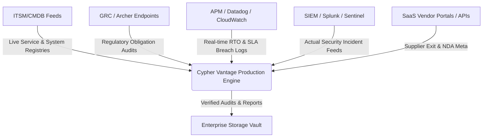

# Cypher Vantage Production Data Model & Dataset Requirements

This document outlines the target relational/document schemas, live integration architectures, and external data feeds required to transition the Cypher Vantage compliance mock architecture into a hardened enterprise production system.

---

## 1. Core Data Models & Schemas

To support fully traceable audits, real-time KRI alerting, and role-based access control, the following relational schemas should be instantiated in an enterprise-grade database (e.g., PostgreSQL or Amazon Aurora).

### 1.1 DORA Articles & Obligations (`obligations` Table)
Represents the core regulatory compliance baseline under DORA.

```sql
CREATE TABLE obligations (
    id VARCHAR(50) PRIMARY KEY,
    article VARCHAR(100) NOT NULL,
    title VARCHAR(255) NOT NULL,
    pillar VARCHAR(100) NOT NULL, -- Risk Management, Incident Reporting, Resilience Testing, TPRM, Info Sharing
    description TEXT NOT NULL,
    compliance_status VARCHAR(50) NOT NULL DEFAULT 'Non-Compliant', -- Compliant, Partial, Non-Compliant
    compliance_deficiency_explanation TEXT, -- Contextual gap notes
    created_at TIMESTAMP WITH TIME ZONE DEFAULT CURRENT_TIMESTAMP,
    updated_at TIMESTAMP WITH TIME ZONE DEFAULT CURRENT_TIMESTAMP
);
```

### 1.2 Important Business & Critical Internal Services (`services` Table)
Represents the business service registry mapping to RTO, RPO, and corporate criticality.

```sql
CREATE TABLE services (
    id VARCHAR(50) PRIMARY KEY,
    name VARCHAR(255) NOT NULL,
    type VARCHAR(50) NOT NULL, -- IBS (Important Business Service), CIS (Critical Internal Service)
    criticality VARCHAR(50) NOT NULL, -- Critical, High, Medium, Low
    region VARCHAR(50) NOT NULL, -- EU, UK, US, Global
    status VARCHAR(50) NOT NULL DEFAULT 'Active', -- Active, Degraded, Outage
    rto_minutes INT NOT NULL, -- Recovery Time Objective target
    rpo_minutes INT NOT NULL, -- Recovery Point Objective target
    owner_email VARCHAR(255) NOT NULL,
    department VARCHAR(100) NOT NULL,
    description TEXT,
    regulatory_impact TEXT,
    created_at TIMESTAMP WITH TIME ZONE DEFAULT CURRENT_TIMESTAMP
);
```

### 1.3 Controls Inventory & Compliance Linkage (`controls` Table)
Describes the operational controls deployed to meet DORA obligations.

```sql
CREATE TABLE controls (
    id VARCHAR(50) PRIMARY KEY,
    obligation_id VARCHAR(50) REFERENCES obligations(id) ON DELETE CASCADE,
    title VARCHAR(255) NOT NULL,
    status VARCHAR(50) NOT NULL DEFAULT 'Gap', -- Met, Partial, Gap
    description TEXT,
    implementation_details TEXT,
    updated_at TIMESTAMP WITH TIME ZONE DEFAULT CURRENT_TIMESTAMP
);
```

### 1.4 Evidence Logs & Integrity Metadata (`evidence` Table)
Maintains cryptographic audit logs proving control operating effectiveness.

```sql
CREATE TABLE evidence (
    id VARCHAR(50) PRIMARY KEY,
    control_id VARCHAR(50) REFERENCES controls(id) ON DELETE CASCADE,
    file_name VARCHAR(255) NOT NULL,
    file_path VARCHAR(512) NOT NULL,
    file_sha256 CHAR(64) NOT NULL, -- For absolute tamper proof validation
    upload_date TIMESTAMP WITH TIME ZONE DEFAULT CURRENT_TIMESTAMP,
    uploaded_by VARCHAR(255) NOT NULL,
    validation_status VARCHAR(50) NOT NULL DEFAULT 'Pending' -- Valid, Expired, Pending
);
```

### 1.5 Service-to-System Traceability Map (`service_dependencies` Join Table)
Connects critical business services to the underlying physical systems and cloud databases.

```sql
CREATE TABLE service_dependencies (
    service_id VARCHAR(50) REFERENCES services(id) ON DELETE CASCADE,
    system_name VARCHAR(100) NOT NULL, -- e.g., PostgreSQL, Salesforce CRM, Cloudflare WAF
    dependency_type VARCHAR(50) NOT NULL, -- Database, API, Network Edge, Storage
    PRIMARY KEY (service_id, system_name)
);
```

### 1.6 Third-Party Supplier Directory & Concentration Tracker (`suppliers` Table)
Maps the supply chain and concentration risks.

```sql
CREATE TABLE suppliers (
    id VARCHAR(50) PRIMARY KEY,
    company_name VARCHAR(255) NOT NULL,
    tier VARCHAR(50) NOT NULL, -- Tier 1 (Core), Tier 2, Tier 3, Tier 4
    service_type VARCHAR(100) NOT NULL, -- Cloud Hosting, Security SaaS, API Gateway
    mapped_services INT NOT NULL DEFAULT 0,
    concentration_score INT NOT NULL DEFAULT 0, -- Calculated risk percentage
    exit_strategy_status VARCHAR(50) NOT NULL DEFAULT 'Gap', -- Defined, Under Review, Gap
    exit_strategy_details TEXT,
    created_at TIMESTAMP WITH TIME ZONE DEFAULT CURRENT_TIMESTAMP
);
```

### 1.7 Operational Resilience Threat Scenarios (`scenarios` Table)
Supports simulation inputs and actual DR/TLPT execution logs.

```sql
CREATE TABLE scenarios (
    id VARCHAR(50) PRIMARY KEY,
    name VARCHAR(255) NOT NULL,
    description TEXT,
    threat_category VARCHAR(50) NOT NULL, -- Cyber, Infrastructure, Third-Party, Power
    likelihood INT NOT NULL, -- Scale 1 to 5
    impact_rating INT NOT NULL, -- Scale 1 to 5
    risk_rating INT GENERATED ALWAYS AS (likelihood * impact_rating) STORED,
    severity VARCHAR(50) GENERATED ALWAYS AS (
        CASE WHEN (likelihood * impact_rating) >= 15 THEN 'Critical' ELSE 'High' END
    ) STORED,
    created_at TIMESTAMP WITH TIME ZONE DEFAULT CURRENT_TIMESTAMP
);
```

---

## 2. Mandatory Production Datasets & Live Feeds

To transition from static mock data to automated real-time compliance reporting, the following integration feeds must be established:



### 2.1 ITSM / CMDB Feeds (Service Registry Integration)
*   **Source**: ServiceNow, Jira Service Management, or internal Configuration Management Databases (CMDB).
*   **Frequency**: Daily delta sync, or instant webhook updates on service topology change.
*   **Data Fields**: Service owner contact registry, network dependency links, active system status, RTO targets.

### 2.2 GRC (Governance, Risk, and Compliance) Feeds
*   **Source**: RSA Archer, MetricStream, or internal Risk Registers.
*   **Frequency**: Real-time push webhooks when a regulatory auditor marks a control as "Retired," "Deficient," or "Met."
*   **Data Fields**: Control test outcomes, regulatory requirement mappings, compliance exceptions.

### 2.3 Real-time Performance & SLA Breaches (APM / Monitoring Data)
*   **Source**: Datadog, Dynatrace, or AWS CloudWatch.
*   **Frequency**: Real-time streaming webhook.
*   **Data Fields**: System response latencies, data replication lags (RPO), synthetic endpoint uptime, live failover RTO breach telemetry.

### 2.4 Incident Management Systems (SIEM / SOC Feeds)
*   **Source**: Splunk, Microsoft Sentinel, ServiceNow Security Incident Response.
*   **Frequency**: Immediate webhook on incident trigger and status lifecycle change.
*   **Data Fields**: Classification tags, downtime calculations, financial loss estimate tracking, escalation logs, root cause metadata.

### 2.5 TPRM & Vendor Management Feeds
*   **Source**: OneTrust, Whistic, Venminder, or internal procurement registries.
*   **Frequency**: Weekly batch ingestion.
*   **Data Fields**: Subcontractor mapping chains, NDA signing dates, exit strategy drill outcomes, vendor risk tiers.
