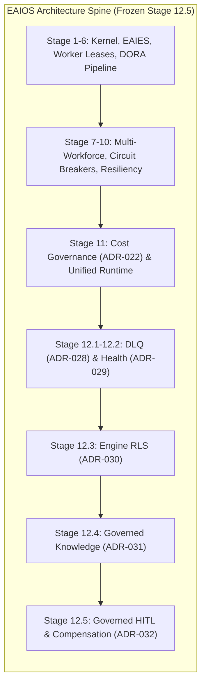
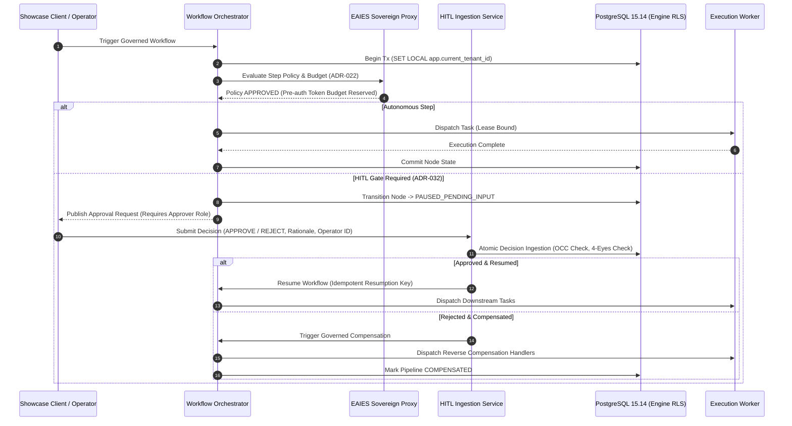
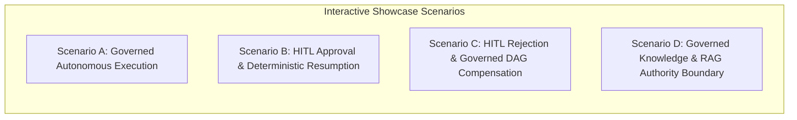
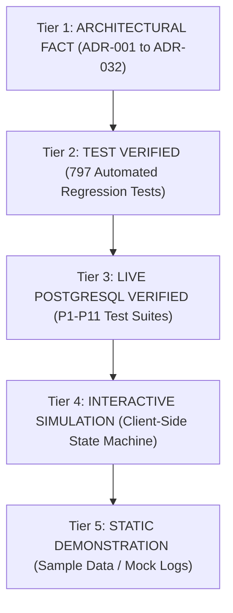
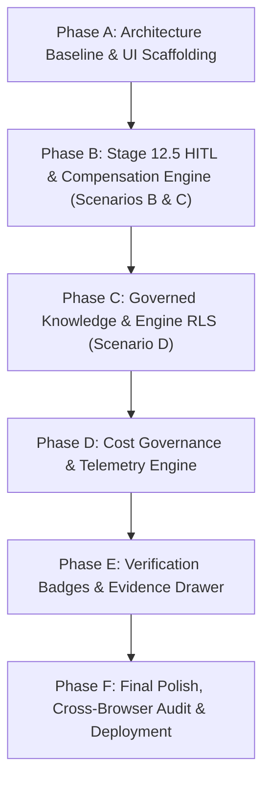

# EAIOS Public Showcase Baseline Readiness Review
**Showcase Repository**: `CypherVantageAI/core-platform`  
**EAIOS Frozen Baseline**: Stage 12.5 (`0302d44713cae7f40ba062f77bddded071fb202c`, tag: `stage-12.5-frozen`)  
**Status**: `GREEN — SHOWCASE BASELINE READY TO IMPLEMENT`  
**Date**: October 2026  
**Audience**: Public, Enterprise Evaluators, System Architects, Compliance Auditors

---

## 1. Executive Summary

The Enterprise AI Operating System (EAIOS) has reached a formally verified and frozen architectural baseline at **Stage 12.5 (ADR-032)**. Stage 12.5 provides governed asynchronous Human-in-the-Loop (HITL) decision ingestion, deterministic workflow resumption, and transactional compensation boundaries on live PostgreSQL 15.14 with engine-level multi-tenant Row-Level Security (RLS).

The existing public showcase repository (`CypherVantageAI/core-platform`), deployed via GitHub Pages, reflects an earlier Stage 6 (Phase 4) capability set. It visualizes basic single-pipeline execution traces and preliminary Enterprise AI Execution Sovereignty (EAIES) evaluations, but omits the core governance primitives developed across Stages 7 through 12.5.

This document establishes the **Public Showcase Baseline Readiness Review**. It translates the frozen EAIOS Stage 12.5 architecture into an actionable, frontend-implementable public demonstration model without modifying the frozen EAIOS repository or weakening system invariants.

### Key Objectives
1. **Bridge the Stage 6 → Stage 12.5 Showcase Gap**: Upgrade the interactive demonstration in `core-platform` to accurately reflect Multi-Workforce Governance, Circuit Breakers, Cost Governance, Engine RLS, Governed RAG/Knowledge boundaries, and Asynchronous HITL Resumption/Compensation.
2. **Uphold the Sovereign Architectural Narrative**: Rigorously communicate that `MODEL ≠ AUTHORITY`, `WORKER ≠ AUTHORITY`, `ORCHESTRATOR ≠ AUTHORITY`, and `HUMAN APPROVAL ≠ CAPABILITY AUTHORITY`.
3. **Formalize the Evidence Model**: Classify every public claim and UI element into verified tiers (`ARCHITECTURAL FACT`, `TEST VERIFIED`, `LIVE POSTGRESQL VERIFIED`, `INTERACTIVE SIMULATION`, or `STATIC DEMONSTRATION`).
4. **Establish Controlled Implementation Phasing**: Define Phases A through F for the showcase upgrade with zero disruption to the frozen core backend.

---

## 2. Current Showcase Assessment (`core-platform`)

The current public showcase in `CypherVantageAI/core-platform` was authored during Phase 4 (Stage 6). An inspection of `index.html`, `app.js`, and `styles.css` reveals the following capabilities and deficiencies:

### 2.1 Existing Capabilities (Stage 6 / Phase 4 Baseline)
- **DORA Pipeline Visualization**: Interactive 7-node execution trace demonstrating a single linear workflow (DORA assessment).
- **Basic EAIES Gate Simulation**: Highlights sovereign policy checks on tool execution.
- **Worker Lease Simulation**: Demonstrates worker node heartbeat, lease acquisition, and execution timeout handling.
- **Telemetry & Event Log**: Live-scrolling event log showing status transitions and JSON payload inspector.

### 2.2 Critical Capability Gaps Against Frozen Stage 12.5
| Domain / Stage | EAIOS Frozen Capability | Current Showcase Status | Showcase Gap |
| :--- | :--- | :--- | :--- |
| **Stage 12.5 (ADR-032)** | Governed Async HITL Ingestion, 4-Eyes Principle, Rejection Pruning, DAG Compensation | **Absent** | No HITL approval/rejection state machine, no compensation rollbacks. |
| **Stage 12.4 (ADR-031)** | Enterprise Knowledge Authority Boundary, Zero Hallucination Vector Injection | **Absent** | Knowledge treated as implicit context rather than governed unauthoritative data. |
| **Stage 12.3 (ADR-030)** | PostgreSQL Engine Multi-Tenant RLS (`SET LOCAL app.current_tenant_id`) | **Absent** | Tenant context not visually isolated or verified against engine boundaries. |
| **Stage 11.2 (ADR-022)** | Resource & Cost Governance, Pre-allocated Token Budgets, Hard Kill Switches | **Absent** | No token consumption metering, budget reservation, or financial governance. |
| **Stage 12.1 / 12.2 (ADR-028/029)** | Governed DLQ Replay, Health Coordination, Distributed Worker Leases | **Partial** | Basic worker lease shown, but no DLQ quarantine, backoff curves, or circuit breakers. |
| **Stage 11.4 / 11.5 (ADR-024/025)** | Multi-Workforce Hierarchical DAG Orchestration | **Partial** | Single linear pipeline; no parallel DAG branch evaluation or join barriers. |

---

## 3. EAIOS Frozen Baseline (Stages 1.0 – 12.5)

The EAIOS platform core is frozen at tag `stage-12.5-frozen` (`0302d44713cae7f40ba062f77bddded071fb202c`). The architecture encompasses 32 Architectural Decision Records (ADRs) and 18 core invariants verified by 797 automated tests and live PostgreSQL 15.14 test suites.



### Authoritative Architecture Invariants
1. **H-01 (EAIES Sovereign Authority)**: Models propose; EAIES disposes. No tool execution or state transition occurs without cryptographically verified EAIES policy clearance.
2. **H-02 (Multi-Tenant Isolation)**: Data isolation enforced at the PostgreSQL engine level via RLS session variables, never purely in application memory.
3. **H-03 (Knowledge as Data)**: Retrieved knowledge chunks (RAG) are unauthoritative data payloads. They cannot expand tool scopes or grant execution authority.
4. **H-04 (Cost Governance)**: Hard financial kill switches. Operations abort deterministically upon budget exhaustion.
5. **H-05 (HITL Transactional Resumption & Compensation)**: Competing HITL decisions serialize via database OCC (`version`). Rejections trigger reverse DAG traversal and idempotent compensation tasks.

---

## 4. Showcase Narrative

The public showcase must convey a clear, uncompromising thesis to enterprise decision-makers, architects, and compliance officers:

> **"Autonomy Without Sovereignty is Liability. EAIOS is the Deterministic Operating System for Governed Enterprise Intelligence."**

### Core Narrative Pillars
1. **The Sovereignty Invariant (`MODEL ≠ AUTHORITY`)**:
   - LLMs are probabilistic generation engines, not trusted execution kernels.
   - EAIOS intercepts every intent, validating authorization, budget, and policy before side effects occur.
2. **Governed Human-in-the-Loop (`HUMAN ≠ CAPABILITY AUTHORITY`)**:
   - Human approval cannot bypass architectural safety gates or grant capabilities outside established policy.
   - Dual-control (4-eyes) enforcement prevents single-operator compromise in high-value actions.
3. **Deterministic Compensation & Rollback**:
   - When a human rejects a paused workflow or an unrecoverable failure occurs, downstream nodes are pruned and executed nodes are deterministically compensated in reverse topological order.
4. **Knowledge Sovereignty**:
   - Enterprise RAG is protected against prompt injection and privilege escalation. Knowledge payloads remain strictly sandboxed.

---

## 5. Architecture Visualization

The showcase will provide an interactive, multi-layered architecture diagram allowing viewers to inspect the EAIOS execution boundary in real time.



---

## 6. Primary Demonstration Scenarios

The showcase frontend will support four distinct interactive scenarios demonstrating the core guarantees of Stage 12.5:



### 6.1 Scenario A: Governed Autonomous Execution (Multi-Node Pipeline)
- **Workflow**: Automated multi-stage data processing and analysis pipeline.
- **Key Interactivity**:
  - Step-by-step DAG node progression (Pending → In-Progress → Completed).
  - Live EAIES policy evaluation badge showing budget reservation, tool scoping, and RLS tenant binding.
  - Telemetry drawer displaying exact JSON execution payloads and lease renewals.
- **Evidence Highlighted**: Hard budget caps (ADR-022), Worker lease isolation (ADR-029).

### 6.2 Scenario B: Human-in-the-Loop Approval & Deterministic Resumption
- **Workflow**: Production infrastructure modification requiring dual-control authorization.
- **Key Interactivity**:
  - Pipeline executes Node 1, reaches Node 2 (HITL Gate), and transitions to `PAUSED_PENDING_INPUT`.
  - Operator interactive modal: View request details, enter approver ID and required rationale.
  - Four-eyes validation: Attempting approval with the requester ID fails with sovereign error; distinct approver succeeds.
  - Workflow deterministically resumes Node 3 without re-executing Node 1.
- **Evidence Highlighted**: Asynchronous HITL Ingestion (ADR-032), 4-Eyes Principle, OCC race fencing.

### 6.3 Scenario C: Human Rejection & Governed DAG Compensation
- **Workflow**: Financial transaction disbursement workflow with pre-allocated ledger entries.
- **Key Interactivity**:
  - Pipeline executes Node 1 (Ledger Hold), pauses at Node 2 (Executive Approval).
  - Operator selects **REJECT** with rationale `"Budget reallocation cancelled by CFO"`.
  - Rejection instantly prunes downstream Node 3 (Disbursement).
  - Reverse compensation executes: Node 1 Compensation Handler releases ledger hold.
  - Final pipeline state transitions to `COMPENSATED` with complete audit trail.
- **Evidence Highlighted**: Deterministic DAG compensation, downstream pruning, audit trail immutability (ADR-032).

### 6.4 Scenario D: Governed Enterprise Knowledge & RAG Authority Boundary
- **Workflow**: Enterprise policy query with external vector knowledge retrieval.
- **Key Interactivity**:
  - Retrieval node fetches knowledge chunk containing adversarial instruction (simulated prompt injection).
  - EAIES boundary inspector reveals knowledge content tagged as `UNTRUSTED_DATA`.
  - Tool execution attempt triggered by injected text is intercepted and blocked by EAIES with `POLICY_VIOLATION`.
- **Evidence Highlighted**: Knowledge as Data invariant (ADR-031), Zero-Privilege Escalation.

---

## 7. Evidence Model & Claim Classification

To prevent overstatement and maintain scientific rigor, all capabilities displayed in the showcase are mapped to an authoritative 5-tier Evidence Hierarchy:



### Claim Classification Matrix
| Showcase Capability / Element | Evidence Tier | Primary Verification Reference |
| :--- | :--- | :--- |
| **EAIES Sovereignty Boundary** | `ARCHITECTURAL FACT` / `TEST VERIFIED` | ADR-001, ADR-014; `tests/test_eaies_proxy.py` |
| **Asynchronous HITL Ingestion** | `TEST VERIFIED` / `LIVE POSTGRESQL VERIFIED` | ADR-032; `tests/test_hitl_postgresql.py` (P1–P11) |
| **Four-Eyes Enforcement** | `TEST VERIFIED` / `LIVE POSTGRESQL VERIFIED` | ADR-032; Test Suite P3 |
| **OCC Terminal State Fencing** | `TEST VERIFIED` / `LIVE POSTGRESQL VERIFIED` | ADR-032; Test Suite P4 |
| **Reverse DAG Compensation** | `TEST VERIFIED` | ADR-032; `tests/test_workflow_compensation.py` |
| **Engine Multi-Tenant RLS** | `LIVE POSTGRESQL VERIFIED` | ADR-030; `tests/test_postgres_rls.py` |
| **Knowledge Authority Boundary** | `ARCHITECTURAL FACT` / `TEST VERIFIED` | ADR-031; `tests/test_knowledge_boundary.py` |
| **Client UI Scenario Runner** | `INTERACTIVE SIMULATION` | `core-platform/app.js` (Deterministic state engine) |

---

## 8. Public Claims & Compliance Review

The showcase strictly avoids marketing hyperbole, non-verifiable claims, or descriptions that imply unconstrained model agency.

### Verified Public Statements
- `"EAIOS enforces execution sovereignty: AI models cannot execute side effects or modify enterprise state without policy clearance."`
- `"Human decisions are ingested asynchronously and serialized via PostgreSQL ACID transactions with optimistic concurrency control."`
- `"Tenant isolation is enforced by the database engine via Row-Level Security, preventing cross-tenant data leakage even in the event of application logic compromise."`
- `"Workflow rejections trigger automatic reverse topological compensation to maintain ledger and system consistency."`

### Prohibited / Non-Compliant Claims
- *Prohibited*: `"Fully autonomous self-governing AI without human supervision."` (Violates Sovereign Governance thesis).
- *Prohibited*: `"100% bug-free AI code generation."` (Violates probabilistic modeling reality).
- *Prohibited*: `"Instant multi-region synchronization."` (EAIOS relies on ACID transaction boundaries).

---

## 9. Required UX & Interface Architecture

The showcase interface in `core-platform` will be updated to a high-density, professional Dark-Mode Enterprise Console:

```
+---------------------------------------------------------------------------------------------------+
|  [LOGO] EAIOS ENTERPRISE SHOWCASE  | Stage 12.5 (Frozen) | Engine: PostgreSQL 15.14 RLS | 797 Tests |
+---------------------------------------------------------------------------------------------------+
| SCENARIO SELECTOR:                                                                                |
| [ (A) Autonomous Run ]  [ (B) HITL Approval ]  [ (C) Rejection & Compensation ]  [ (D) RAG Guard ]|
+----------------------------------------------------+----------------------------------------------+
| WORKFLOW DAG VISUALIZER                            | SOVEREIGN INSPECTOR & TELEMETRY              |
|                                                    |                                              |
|  [Node 1: Init] ---> [Node 2: HITL Gate]           | ACTIVE NODE: Node 2 (HITL Approval Gate)     |
|         |                     |                    | STATUS: PAUSED_PENDING_INPUT                 |
|         v                     v                    | TENANT ID: tenant-alpha-001 (RLS BOUND)      |
|  [Comp 1: Revert]    [Node 3: Execution]           | EAIES POLICY: HITL_REQUIRED                  |
|                                                    | TOKEN BUDGET: 1,500 / 10,000 (Reserved)      |
|                                                    | -------------------------------------------- |
|                                                    | INTERACTIVE OPERATOR CONSOLE:                |
|                                                    | Approver ID: [ usr_approver_02 ]             |
|                                                    | Rationale:   [ Approved for production run ] |
|                                                    | [ APPROVE & RESUME ]    [ REJECT & COMPENSATE]|
+----------------------------------------------------+----------------------------------------------+
| SYSTEM EVENT LOG & VERIFICATION EVIDENCE                                                          |
| [14:02:11] [EAIES] Token budget 1500 pre-authorized for workflow wf-9821                          |
| [14:02:12] [HITL] Node 2 transitioned to PAUSED_PENDING_INPUT (Evidence: Live PG Test P1)         |
+---------------------------------------------------------------------------------------------------+
```

### Core UI Modules
1. **Header & Baseline Badge**: Displays frozen commit `0302d447`, tag `stage-12.5-frozen`, and 797/797 test badge.
2. **Scenario Control Bar**: Instant switching between Scenarios A, B, C, and D with clean state reset.
3. **Interactive DAG Canvas**: SVG/CSS-rendered directed acyclic graph with animated node state transitions (Pending, Running, Paused, Succeeded, Pruned, Compensated).
4. **Sovereign Inspector Drawer**: Deep-dive inspector displaying EAIES decision payload, tenant context, token reservation, and 4-eyes validation.
5. **Interactive HITL Operator Modal**: Allows visitors to test dual-control rules and trigger compensation live.
6. **Live Telemetry Stream**: Structured JSON audit log detailing every state mutation with references to the underlying ADR and test proof.

---

## 10. Feature Prioritisation (MoSCoW Matrix)

| Priority | Feature / Capability | Implementation Target |
| :--- | :--- | :--- |
| **MUST HAVE** | Stage 12.5 HITL Approval & Deterministic Resumption (Scenario B) | Phase B |
| **MUST HAVE** | Stage 12.5 Rejection Pruning & Reverse Compensation (Scenario C) | Phase B |
| **MUST HAVE** | Four-Eyes Sovereign Enforcement in Interactive Modal | Phase B |
| **MUST HAVE** | Evidence Classification Badges for all Telemetry & Claims | Phase A |
| **MUST HAVE** | Frozen Stage 12.5 Baseline Header & Architectural Badges | Phase A |
| **SHOULD HAVE** | Stage 12.4 Governed Knowledge / Prompt Injection Interception (Scenario D) | Phase C |
| **SHOULD HAVE** | Stage 12.3 Multi-Tenant RLS Session Context Visualization | Phase C |
| **SHOULD HAVE** | Stage 11.2 Real-time Token Budget Metering & Kill-Switch Simulation | Phase D |
| **COULD HAVE** | Stage 12.1 DLQ Failure & Governed Replay Interactive Trigger | Phase E |
| **WONT HAVE (Now)** | Live Backend WebSocket connection to local PostgreSQL (remains pure client-side simulation on GitHub Pages) | Out of Scope |

---

## 11. Security Review

Because `core-platform` is a public client-side web application hosted on GitHub Pages:

1. **Zero Secret Exposure**: The showcase contains no API keys, private keys, database connection strings, or production credentials.
2. **Client-Side Isolation**: All interactive simulations run inside a sandboxed browser environment (`app.js`).
3. **No External Code Execution**: The showcase does not evaluate dynamic untrusted JavaScript (`no eval()`, `no new Function()`).
4. **Strict Content Security**: All styling and logic remain self-contained with zero third-party tracking dependencies.

---

## 12. Performance & Deployment Review

1. **Target Platform**: GitHub Pages (Static HTML5/CSS3/Vanilla ES6 JavaScript).
2. **Bundle Size Target**: `< 250 KB` total footprint (zero heavy runtime frameworks like React/Angular; zero build-step overhead).
3. **Load Performance**: 60 FPS animation on standard mobile and desktop viewports; sub-500ms initial load time.
4. **Browser Compatibility**: Full modern browser support (Chrome, Safari, Edge, Firefox).

---

## 13. EAIOS Boundary & Non-Modification Constraints

The boundary between the frozen core engine and the public showcase repository is absolute:

```
[ FROZEN REPOSITORY ]                               [ SHOWCASE REPOSITORY ]
enterprise-ai-operating-system                     core-platform
- Tag: stage-12.5-frozen                           - GitHub Pages Frontend
- Commit: 0302d44713cae7f40ba...                   - Pure Presentation & Simulation
- STATUS: FROZEN / ZERO MODIFICATION               - STATUS: TARGET FOR UPGRADE
         |                                                   |
         +------------------- NO CROSS-WRITES ---------------+
```

### Inviolable Rules
- **Rule 1**: Zero changes, zero commits, zero pushes to `enterprise-ai-operating-system`.
- **Rule 2**: No import of backend Python modules into the static frontend.
- **Rule 3**: The showcase represents frozen reality; it does not invent or extrapolate unreleased Stage 13 features.

---

## 14. Phased Implementation Plan



- **Phase A (Baseline & UI Scaffolding)**: Upgrade `index.html` structure, establish Stage 12.5 header, evidence badges, and CSS grid layout.
- **Phase B (HITL & Compensation Engine)**: Implement Scenarios B & C state machine in `app.js`, including 4-eyes modal, approval resumption, rejection pruning, and reverse compensation.
- **Phase C (Governed Knowledge & RLS)**: Implement Scenario D with prompt injection interception and RLS session context display.
- **Phase D (Cost Governance & Telemetry)**: Add live token budget consumption graphs and structured audit event streaming.
- **Phase E (Verification & Evidence)**: Link every UI telemetry event to its exact ADR, pytest test case, and live PostgreSQL verification suite.
- **Phase F (Audit & Deployment)**: End-to-end responsiveness check, accessibility verification, and GitHub Pages release.

---

## 15. Acceptance Criteria

The public showcase upgrade will be deemed complete when:

1. [ ] **Scenario A** executes smoothly with multi-node state transitions and EAIES policy badges.
2. [ ] **Scenario B** successfully halts at Node 2, rejects same-user approval (4-eyes), and resumes Node 3 upon valid dual approval.
3. [ ] **Scenario C** prunes downstream nodes upon rejection and visibly executes reverse compensation on Node 1.
4. [ ] **Scenario D** visually isolates retrieved knowledge and intercepts simulated privilege escalation.
5. [ ] **Evidence Classification** is clearly displayed across all system cards.
6. [ ] **Clean Git Hygiene**: `enterprise-ai-operating-system` remains 100% clean and frozen; `core-platform` builds cleanly with zero external runtime dependencies.

---

## 16. Long-Term Roadmap Boundary

The public showcase is explicitly constrained to **Stages 1.0 through 12.5**. Future capabilities (e.g., Stage 13 Distributed Multi-Cluster Consensus, Decentralized Identity Mesh) must NOT be simulated or claimed until formally implemented, tested, and frozen in the EAIOS core repository.

---

## 17. Risk Analysis & Mitigation

| Identified Risk | Severity | Mitigation Strategy |
| :--- | :--- | :--- |
| **Over-Promising Capabilities** | High | Enforce strict Evidence Hierarchy (Tiers 1–5) on every claim. |
| **Core Repository Contamination** | Critical | Strict git workspace separation; zero file writes to EAIOS repo. |
| **Simulation Drift from ADR-032** | Medium | Direct 1:1 mapping of `app.js` state transitions to ADR-032 state machine specifications. |
| **Performance Degradation** | Low | Pure vanilla JavaScript and CSS animations; zero heavy frameworks. |

---

## 18. Final Showcase Readiness Verdict

```
================================================================================
FINAL SHOWCASE READINESS VERDICT:
GREEN — SHOWCASE BASELINE READY TO IMPLEMENT
================================================================================
- EAIOS Frozen Baseline: Stage 12.5 (0302d44713cae7f40ba062f77bddded071fb202c)
- EAIOS Repository Status: FROZEN / UNTOUCHED
- Showcase Target Repository: CypherVantageAI/core-platform
- Target Scope: 4 Interactive Scenarios (A, B, C, D) + Evidence Model
- Implementation Authorization: READY FOR CONTROLLED FRONTEND IMPLEMENTATION
================================================================================
```
