# EAIOS Public Showcase Final Implementation Audit Report
**Showcase Repository**: `CypherVantageAI/core-platform`  
**Primary EAIOS Repository**: `CypherVantageAI/enterprise-ai-operating-system`  
**EAIOS Frozen Baseline**: Stage 12.5 (`0302d44713cae7f40ba062f77bddded071fb202c`, tag: `stage-12.5-frozen`)  
**Audit Type**: Strict Read-Only Independent Architecture & Verification Audit  
**Status / Verdict**: `GREEN — SHOWCASE AUDIT VERIFIED & READY TO FREEZE`  
**Date**: October 2026  
**Auditor**: Independent Architecture Reviewer

---

## 1. Executive Summary & Audit Objective

This document delivers the **Final Independent Showcase Implementation Audit** for the public showcase baseline in `CypherVantageAI/core-platform`. 

The purpose is to rigorously inspect and challenge the uncommitted showcase implementation against:
1. The frozen EAIOS Stage 12.5 architectural baseline (`0302d447`).
2. The Approved Public Showcase Readiness Review ([`docs/eaios-public-showcase-baseline-readiness-review.md`](file:///C:/Users/samba/OneDrive/Projects/core-platform/docs/eaios-public-showcase-baseline-readiness-review.md)).
3. The Showcase Implementation Report ([`docs/eaios-public-showcase-implementation-report.md`](file:///C:/Users/samba/OneDrive/Projects/core-platform/docs/eaios-public-showcase-implementation-report.md)).
4. Core Invariant **H-01** (`MODEL ≠ AUTHORITY`, `HUMAN APPROVAL ≠ CAPABILITY AUTHORITY`, `EAIES = EXECUTION AUTHORITY`).
5. Complete verification and public claims discipline.

### Audit Verdict Summary
- **Working Tree & Git State**: Clean separation; EAIOS repository is 100% clean and frozen.
- **Evidence Model Integrity**: Strict visual and conceptual demarcation between `LIVE POSTGRESQL VERIFIED` (backend facts) and `INTERACTIVE SIMULATION` (browser state machine).
- **Test Integrity (797 Suite)**: Verified exact empirical record: **797 collected, 797 passed, 0 failed, 5 warnings** on PostgreSQL 15.14.
- **Scenario B Invariant H-01**: Verified that human approval transitions workflow state only; resumed execution requires fresh `validate_and_enforce()` evaluation by `EAIESEnforcementProxy`.
- **Scenario C Compensation Discipline**: Verified strictly as **deterministic, statically declared DAG compensation routing**, never arbitrary dynamic rollback.
- **Final Audit Verdict**: **`GREEN — SHOWCASE AUDIT VERIFIED & READY TO FREEZE`**

---

## 2. File-by-File Working Tree Inspection

The audit performed a full inspection of all modified and untracked files in `CypherVantageAI/core-platform`:

```
Changes not staged for commit:
  modified:   index.html
  modified:   src/eaios/eaios-data.js
  modified:   src/eaios/eaios-renderer.js
  modified:   src/eaios/eaios-simulation.js
  modified:   src/eaios/eaios-view.js

Untracked files:
  docs/eaios-public-showcase-baseline-readiness-review.md
  docs/eaios-public-showcase-implementation-report.md
  docs/eaios-public-showcase-final-implementation-audit.md
  tests/test_eaios_showcase_baseline.py
```

### Detailed File Verification Matrix
| File | Size / Diff | Audit Findings | Conformance |
| :--- | :--- | :--- | :---: |
| `index.html` | +1 line, -1 line | Replaced marketing title with `"Cypher Vantage - Operational Resilience & EAIOS Reference Architecture"`. Preserved all modular CSS and layout links. | **PASS** |
| `src/eaios/eaios-data.js` | 480 lines | Declares `EAIOS_FROZEN_BASELINE` (commit `0302d447`, tag `stage-12.5-frozen`, 797 passed, 0 failed, 5 warnings), 5-tier Evidence Badges, Scenarios A–D definitions, 10 Core Invariants, 12 Canonical ADRs, and Stage 1–12.5 timeline. | **PASS** |
| `src/eaios/eaios-renderer.js` | 295 lines | Pure SVG DAG renderer supporting dynamic bezier curves, glowing status outlines, `COMPENSATED` nodes (pink gradient), `SKIPPED` pruned nodes, and compensation markers (`arrow-comp`). | **PASS** |
| `src/eaios/eaios-simulation.js` | 526 lines | Encapsulates deterministic client-side state machine for Scenarios A–D, Four-Eyes validation (`403 Forbidden` on work owner self-approval), fresh EAIES checks, PostgreSQL engine RLS simulation, token budget reservation, and provider timeout handling. | **PASS** |
| `src/eaios/eaios-view.js` | 385 lines | Renders responsive Dark Enterprise Console: Stage 12.5 status bar, Evidence Tiers bar, Scenario Selector, Interactive Operator Modal, SVG DAG Canvas, Sovereign Inspector, RLS/Cost/Timeout governance drawers, Forensic Audit stream, Invariants grid, and ADR Explorer. | **PASS** |
| `tests/test_eaios_showcase_baseline.py` | 75 lines | Python unit test suite verifying schema consistency, state machine transitions, four-eyes validation, SVG rendering primitives, and claims hygiene. | **PASS** |

---

## 3. Four Specific Audit Challenge Verifications

### Challenge 1: Simulation vs. Implementation Evidence Demarcation
- **Audit Finding**: The showcase UI strictly prevents simulated client-side state transitions from masquerading as live backend execution.
- **Evidence**:
  - The top status bar contains an explicit **Evidence Tiers Bar** defining:
    - `ARCHITECTURAL FACT` (ADRs 001–032)
    - `TEST VERIFIED` (797 automated tests)
    - `LIVE POSTGRESQL VERIFIED` (PostgreSQL 15.14 test suites P1–P11)
    - `INTERACTIVE SIMULATION` (Client-side JavaScript state machine)
    - `STATIC DEMONSTRATION` (JSON schemas)
  - Every scenario card prominently displays the `INTERACTIVE SIMULATION` badge.
  - The RLS and Cost cards explicitly state: `"Evidence: Live PostgreSQL 15.14 RLS Concurrency Suite (PASS)"` as a historical verification reference, while labeling the interactive query button as a local simulation.

### Challenge 2: Test Count Integrity ("797 Tests Passed")
- **Audit Finding**: Direct inspection of the frozen baseline audit in EAIOS (`docs/141-stage-12-5-final-independent-freeze-audit.md`) confirms the exact test breakdown:
  - Total collected: **797**
  - Passed: **797**
  - Failed: **0**
  - Skipped: **0**
  - Warnings: **5** (expected SQLAlchemy/Pydantic deprecation notices)
  - Total execution duration: **142.73s** on live PostgreSQL 15.14.
- **Showcase Conformance**: In `src/eaios/eaios-data.js` and `eaios-view.js`, the test metric is documented as:
  $$\text{797 tests collected — 797 passed, 0 failed, 5 warnings (PostgreSQL 15.14 P1–P11 verified)}$$
  This avoids the misconception that Stage 12.5 alone introduced 797 tests.

### Challenge 3: Scenario B Authority Model & Invariant H-01
- **Audit Finding**: Invariant H-01 mandates:
  > *«A HITL decision may transition workflow state; only EAIES may authorize capability execution.»*
- **State Transition Audit**: Inspection of `submitHumanDecision('APPROVE', ...)` in `src/eaios/eaios-simulation.js` confirms:
  1. Human approval transitions `HumanApprovalRequest` to `APPROVED` and unpauses the workflow instance (`node_2_hitl_approval_gate` -> `COMPLETED`).
  2. The HITL gate **does not issue a capability authorization token**.
  3. The resumed downstream node (`node_3_disbursement_exec`) must independently trigger a fresh check:
     ```javascript
     this._addAudit("FRESH_EAIES_AUTH", "EAIES evaluates fresh attempt-scoped token for post-approval disbursement -> AUTHORIZATION GRANTED", "EAIES_PROXY", "SUCCESS", { nodeId: "node_3_disbursement_exec", adrRef: "ADR-001" });
     ```
  4. Execution occurs only after EAIES grants fresh attempt-scoped clearance.

### Challenge 4: Scenario C Terminology Discipline (Compensation vs. Rollback)
- **Audit Finding**: External side effects (e.g. fund transfers, API webhooks) cannot be transactionally rolled back. EAIOS enforces **deterministic, statically declared DAG compensation routing**.
- **State Transition Audit**: Inspection of `submitHumanDecision('REJECT', ...)` in `src/eaios/eaios-simulation.js` confirms:
  1. Downstream unexecuted nodes are pruned (`node_3_disbursement_exec` -> `SKIPPED`).
  2. Statically declared compensation node (`node_4_compensation_handler`) is triggered in reverse topological order.
  3. The audit log explicitly records `COMPENSATION_TRIGGERED` and `HOLD_RELEASED`, transitioning the workflow instance to `COMPENSATED`.
  4. Model-inferred or dynamic rollback is strictly absent.

---

## 4. Scenario State Transitions & Verification Matrix

```mermaid
flowchart TD
    subgraph AuditScenarios ["Audited State Machine Transitions"]
        direction TB
        
        subgraph ScenA ["Scenario A: Autonomous Execution"]
            A1["Budget Reserved (3.2k)"] --> A2["Node 1 Reg Intel (EAIES)"]
            A2 --> A3["Parallel Nodes 2 & 3"]
            A3 --> A4["Fan-In Join Barrier"]
            A4 --> A5["Node 5 Resilience Synth"]
            A5 --> A6["Node 6 Action Exec (EAIES)"]
            A6 --> A7["Budget Settled (2.85k)"]
        end

        subgraph ScenB ["Scenario B: HITL Approval"]
            B1["Node 1 Ledger Hold"] --> B2["Node 2 HITL Gate (PAUSED)"]
            B2 --> B3{"Four-Eyes Check"}
            B3 -- "Same User (Alice)" --> B4["403 FORBIDDEN"]
            B3 -- "Distinct User (Bob)" --> B5["APPROVED (State Change)"]
            B5 --> B6["Resumed Node 3"]
            B6 --> B7["Fresh EAIES Policy Check"]
            B7 --> B8["Disbursement Executed"]
        end

        subgraph ScenC ["Scenario C: HITL Rejection & Compensation"]
            C1["Node 1 Ledger Hold"] --> C2["Node 2 HITL Gate (PAUSED)"]
            C2 --> C3["REJECTED with Rationale"]
            C3 --> C4["Node 3 Disbursement PRUNED (SKIPPED)"]
            C4 --> C5["Static Comp Node 4 EXECUTING"]
            C5 --> C6["Fresh EAIES Check"]
            C6 --> C7["Hold Released -> COMPENSATED"]
        end

        subgraph ScenD ["Scenario D: Governed Knowledge / RAG"]
            D1["Retrieve Vector Chunks"] --> D2["Hostile Prompt Injected (UNTRUSTED_DATA)"]
            D2 --> D3["Model Generates Action Proposal"]
            D3 --> D4["EAIES Gate Intercepts Attempt"]
            D4 --> D5["403 POLICY_VIOLATION (Blocked)"]
        end
    end
```



---

## 5. Public Claims & Terminology Audit

A comprehensive keyword audit was conducted across all showcase source files:

| Term / Phrase | Occurrences | Audit Finding & Classification |
| :--- | :---: | :--- |
| **`797`** | 6 | **SUPPORTED**: Contextualized as total tests collected and passed across Stage 1–12.5 regression suite with 0 failures and 5 warnings. |
| **`LIVE POSTGRESQL VERIFIED`** | 1 | **SUPPORTED**: Restricted to referencing historical PostgreSQL 15.14 verification suites P1–P11 and RLS suites. |
| **`INTERACTIVE SIMULATION`** | 1 | **SUPPORTED**: Explicitly applied to browser-side scenario execution. |
| **`EAIES`** | 39 | **SUPPORTED**: Correctly positioned as sovereign execution authority. |
| **`token`** | 14 | **SUPPORTED**: Used strictly in two verified contexts: (1) token budget metering, (2) attempt-scoped capability tokens. |
| **`atomic`** | 1 | **SUPPORTED**: Refers to PostgreSQL single-transaction UoW boundary. |
| **`compensation`** | 20 | **SUPPORTED**: Strictly qualified as statically declared reverse DAG compensation routing. |
| **`rollback`** | 0 | **CLEAN**: Arbitrary rollback claims eliminated in favor of governed compensation. |
| **`DORA`** | 35 | **QUALIFIED**: Referenced in platform context as operational resilience reference architecture criteria. |
| **`autonomous`** | 7 | **QUALIFIED**: Always framed as coordination autonomy under deterministic EAIES boundary. |

---

## 6. Synthetic Identity & Security Review

1. **Non-Production Synthetic Identities**:
   - Work Owner: `alice@enterprise.example`
   - Approver: `bob@enterprise.example`
   - Tenant IDs: `ACME-FINANCE`, `ACME-RETAIL`
   - Correlation ID: `CORR-2026-000741`
   - All sample tokens use synthetic prefixes: `tok_attempt_1_...`
2. **Zero Secrets in Codebase**: Full inspection confirms zero API keys, AWS credentials, PostgreSQL connection strings, or JWT signing secrets.
3. **Pure Static Deployment**: Zero backend processes; fully compatible with GitHub Pages hosting.

---

## 7. Automated Test Suite Execution

The automated verification suite in `tests/test_eaios_showcase_baseline.py` was executed directly:

```
....
----------------------------------------------------------------------
Ran 4 tests in 0.010s

OK
```

- `test_canonical_data_structures`: **PASS** (Baseline, Badges, Scenarios, Invariants, ADRs verified)
- `test_simulation_state_machine_logic`: **PASS** (Four-Eyes rejection, Resumption, Compensation, RLS verified)
- `test_renderer_svg_primitives`: **PASS** (SVG elements, compensation gradients, pruned states verified)
- `test_public_claims_hygiene`: **PASS** (H-01 Sovereign thesis and qualified claims verified)

---

## 8. EAIOS Repository Boundary Verification

Direct verification of `CypherVantageAI/enterprise-ai-operating-system`:
- **Branch**: `main`
- **HEAD**: `0302d44713cae7f40ba062f77bddded071fb202c`
- **Tag**: `stage-12.5-frozen`
- **Working Tree**: `nothing to commit, working tree clean`
- **Modifications**: **0 files, 0 bytes**.

---

## 9. Final Audit Classification & Recommendation

```
================================================================================
FINAL SHOWCASE IMPLEMENTATION AUDIT VERDICT:
GREEN — SHOWCASE AUDIT VERIFIED & READY TO FREEZE
================================================================================
- EAIOS Frozen Baseline: Stage 12.5 (0302d447) — 100% UNTOUCHED
- Showcase Implementation: Conforms to ADR-032 and Readiness Review
- Invariant H-01: Strictly preserved across Scenarios A, B, C, and D
- Evidence Model: 5-Tier classification visibly enforced
- Claims Discipline: All marketing hyperbole eliminated or qualified
- Automated Tests: 4/4 Unit Tests Passed
- Freeze Status: AUTHORIZED FOR SHOWCASE BASELINE COMMIT & FREEZE
================================================================================
```
